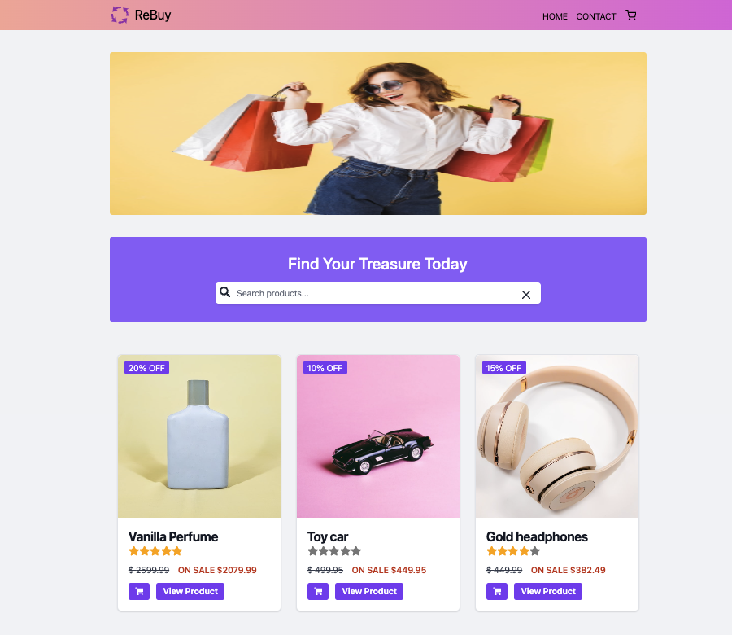

# ReBuy e-commerce Store 


## Description
[Rebuy](https://rebuy-store.netlify.app/) is a modern e-commerce web application built as a course assignment for JavaScript frameworks at Noroff. It is developed using ReactVite and Tailwind CSS, providing users with a seamless shopping experience to browse and purchase gadgets.

### Features
* Browse a wide range of gadgets
* View detailed product information
* Add products to the cart
* Contact form
* Responsive design for optimal viewing on all devices

## Built with
* React
* TailwindCSS
* Nordoff API

## Getting started
### Installation

1. Clone the project
```
https://github.com/chalund/js-framework-ca.git
```

2. Install NPM packages
```
npm install
```

3. Start the project
```
npm start
```

### Run the application
1. Start the development server
````
npm run dev
````
2. View in Browser
Open the provided localhost link in your preferred web browser

## Contributing
To contribute, either open a pull request for code changes or create an issue for problems or feature requests. Your input is appreciated!

## License
This project is licensed under the MIT License - see the LICENSE.md file for details

## Contact
[](https://pe.linkedin.com/in/charlotte-lund-48419b249/)
[](https://github.com/chalund)
[](mailto:chalund@gmail.com)

